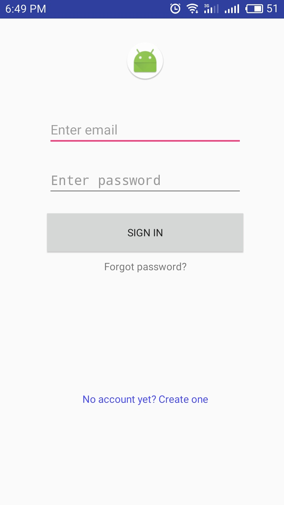
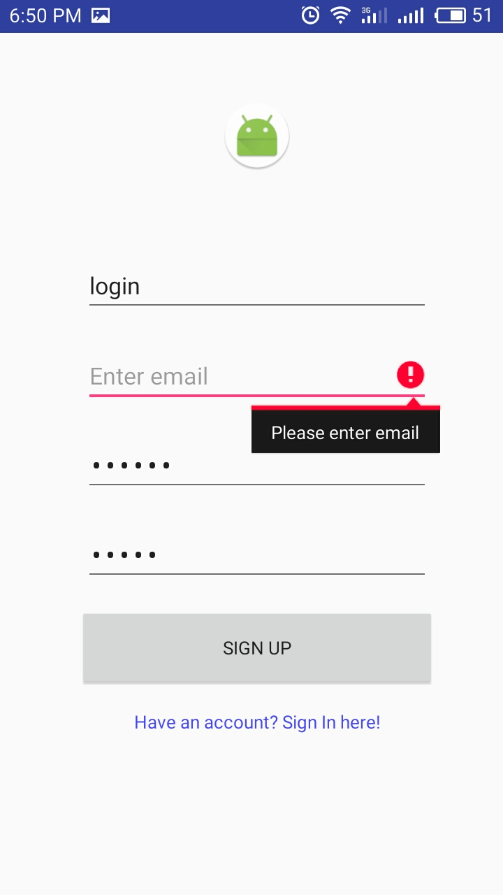
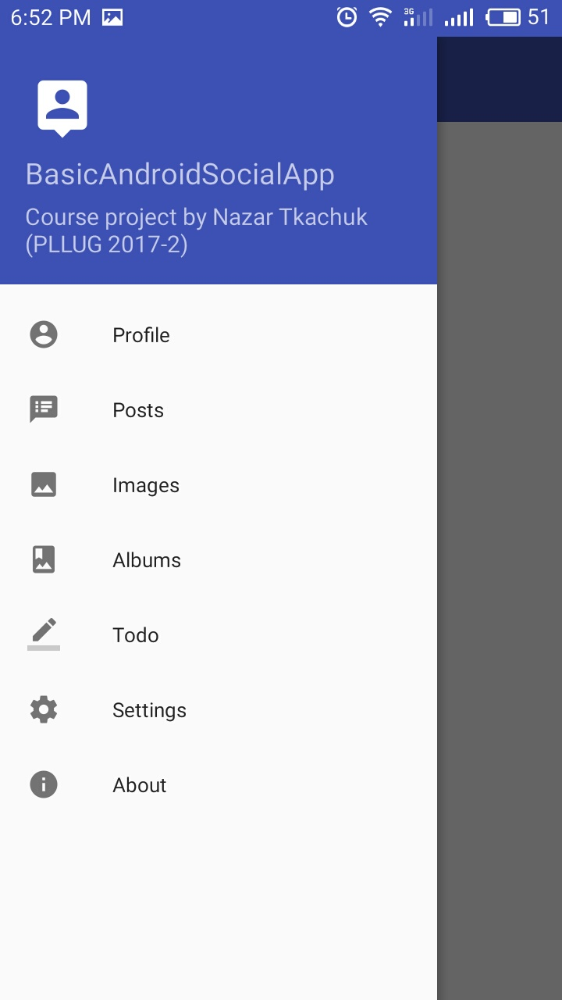
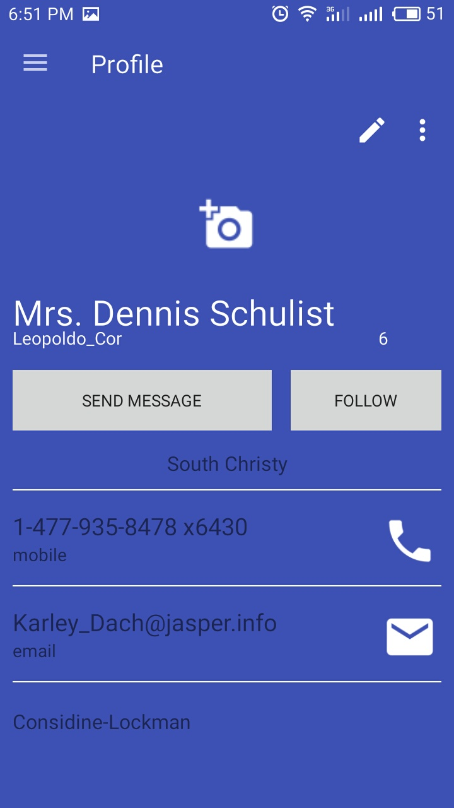
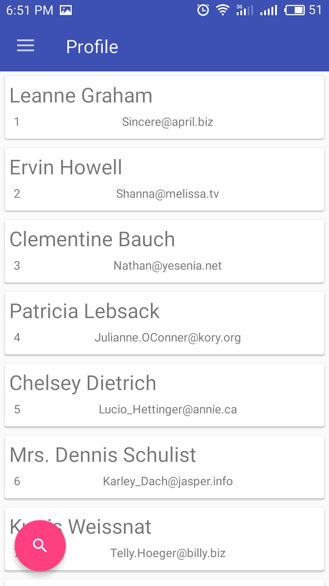
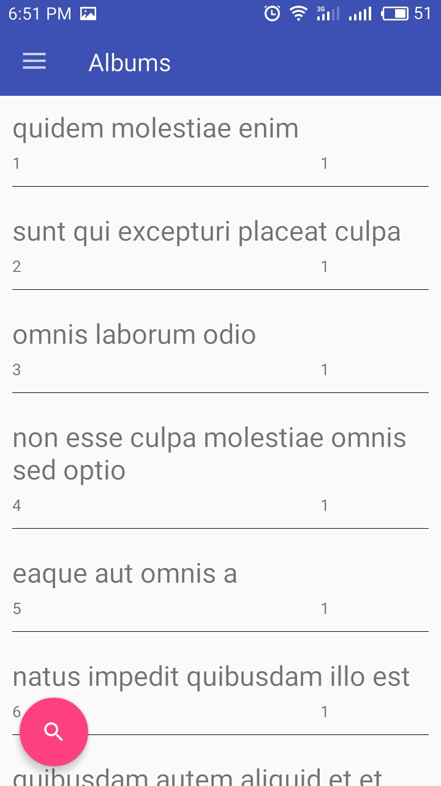
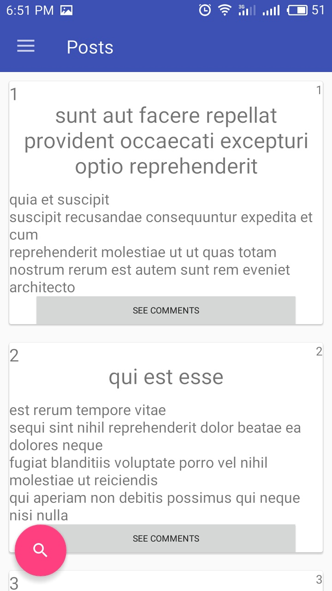
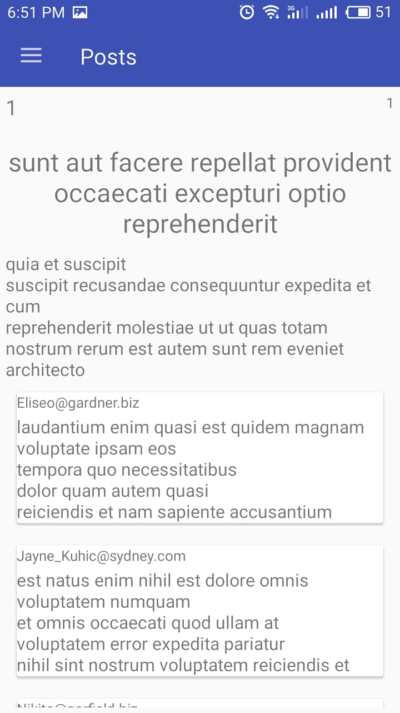
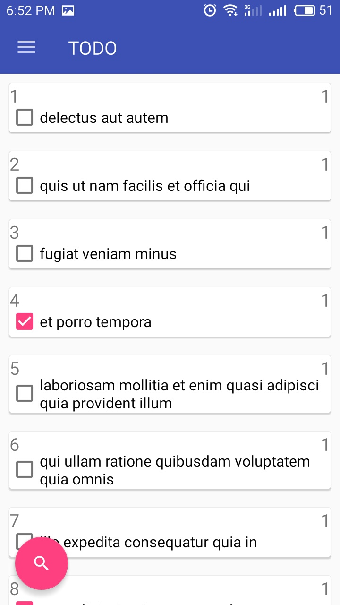
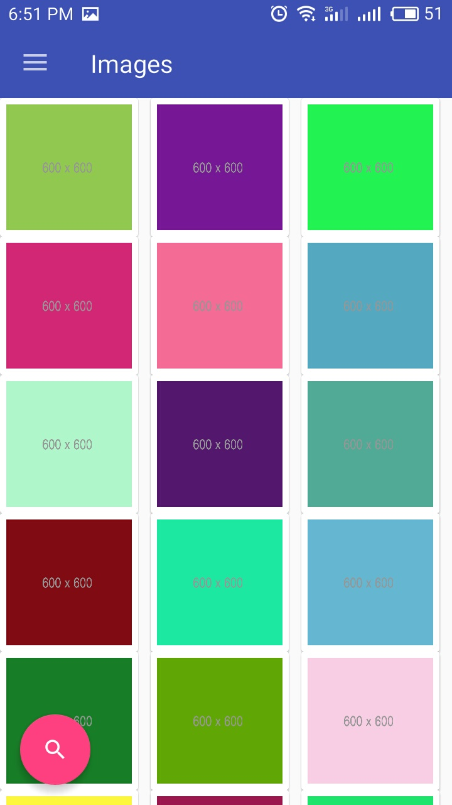

# BasicAndroidSocialApp

Education project ([Course Work](https://docs.google.com/document/d/14UDe7SXd2zrWBW0XNbPjL5oz43zMdSm6IjXCbADizDA/edit)) using [Fake Online REST API](http://jsonplaceholder.typicode.com).

## Project description
Application has several screens with different functionality. There are 2 main groups of application components:
# Authorization group:
Login screen | Sign up screen | Forgot password
-------------|----------------- | -------------
  |  | 

# Main screen group:

Menu | Profile screen | Profiles screen | Albums screen 
-------------|----------------- | ------------- | -------------
  |  |  | 

Posts screen | Comments screen | Todos screen | Images screen
-------------|----------------- | ------------- | -------------
  |  |  | 

Application can communicate with remove server and get different data about: Users, Posts, Comments, Albums, Images, Todos.

## Used libraries
* com.squareup.retrofit2:retrofit:2.3.0 
* com.google.code.gson:gson:2.7 - working with JSON object.
* com.squareup.retrofit2:converter-gson:2.0.2 - convert JSON data.
* com.squareup.okhttp3:okhttp:3.6.0 - a part of Retrofit2.
* com.squareup.okhttp3:logging-interceptor:3.6.0
* com.squareup.picasso:picasso:2.5.2 - help getting images from site.

* com.android.support:appcompat-v7:26.+'
* com.android.support:design:26.+'
* com.android.support:cardview-v7:26.+

## License
This application is Free Software ([GNU General Public License](https://www.gnu.org/licenses/gpl.html)).
